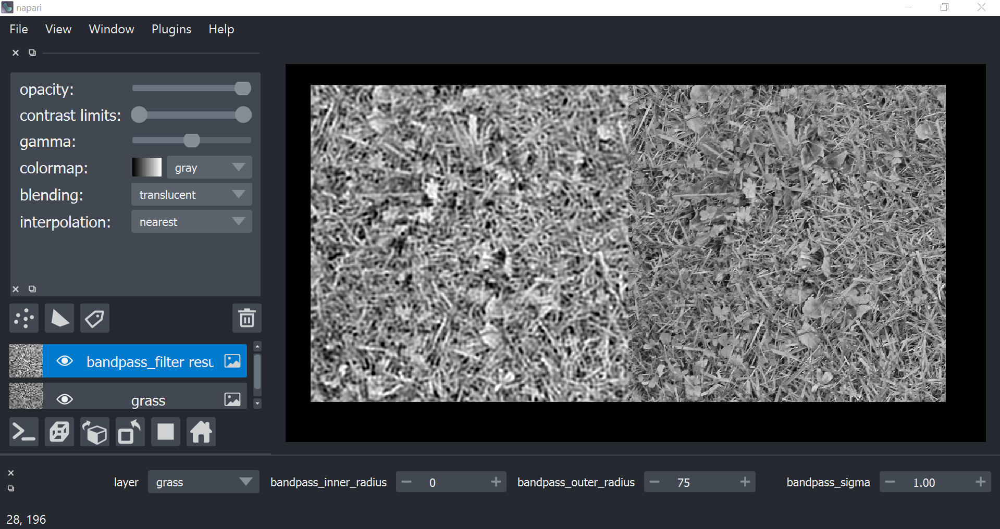

# Bandpass filter parameter search

A simple GUI to visualize bandpass filtering with different parameters.

## Pre-requisites
Python (we recommend the
[Anaconda distribution of Python](https://www.anaconda.com/products/individual))

## Setup
Create your virtual python environment.

Eg: open the Anaconda Prompt and create a new conda environment
with the dependency requirements:

```
conda create bandpass-filter-env pip
conda activate bandpass-filter-env
pip install -r requirements.txt
```

## Run the program
You can run the program from the Anaconda Prompt terminal by activating the
virtual environment and then calling the bandpass filter script with python.

```
conda activate bandpass-filter-env
python bandpass_filter.py
```

You'll see a napari window appear with controls for the bandpass filter
parameters at the bottom. Adjust the values to see the output preview image
update.

You can try this with your own data. Go to `File > Open` to load your own image,
then change the `layer` dropdown menu to select the image layer with your own
data.


